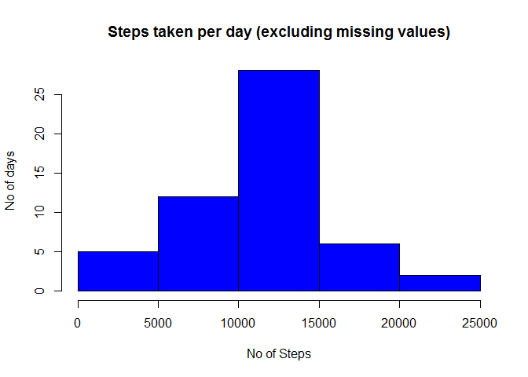
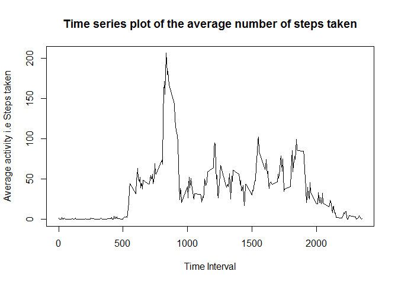
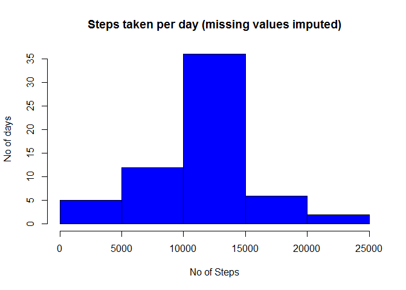
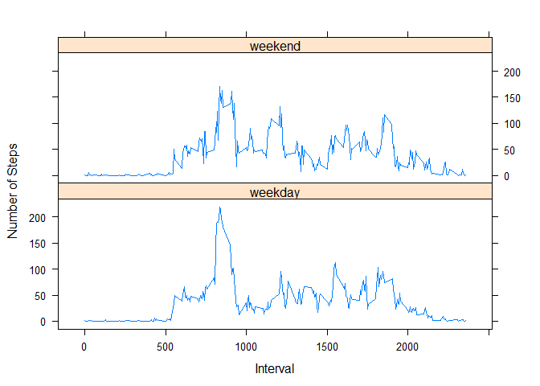

# Reproducible Research: Peer Assessment 1


## Loading and preprocessing the data

```r
  # unzip and read the dataset, get a tidy dataset.
  unzip("activity.zip")
  act <- read.csv("activity.csv", header = TRUE)
  
  # get the date format right.
  act$date <- as.POSIXct(act$date, format="%Y-%m-%d")
  
  act.good <- na.omit(act) # Tidy data set.
```

## What is mean total number of steps taken per day?

```r
  # get an aggregate subset and plot a histogram
  act.agg <- aggregate(steps ~ date, act.good, sum )

  hist(act.agg$steps, col = "blue", xlab = "No of Steps",
        ylab = "No of days", main = "Steps taken per day (excluding missing values)")
```

 

```r
  # Now mean and median of steps taken per day.
  cat("Mean of Steps taken per day: ", mean(act.agg$steps))
```

```
## Mean of Steps taken per day:  10766.19
```

```r
  cat("Median of Steps taken per day: ", median(act.agg$steps))
```

```
## Median of Steps taken per day:  10765
```


## What is the average daily activity pattern?

```r
  # get the mean subset and plot a graph.
  act.mean <- aggregate(steps ~ interval, act.good, mean)
  
  plot(act.mean$interval, act.mean$steps, type = "l", 
       xlab = "Time Interval", ylab = "Average activity i.e Steps taken",
       main = "Time series plot of the average number of steps taken")
```

 

```r
  cat("5 Min Interval that contains maximum number of steps: ",
      act.mean[which(act.mean$steps == max(act.mean$steps)), 1])
```

```
## 5 Min Interval that contains maximum number of steps:  835
```


## Imputing missing values
#### Strategy:
    Idea here is simple.  
    Fill the missing vaues with caclulated mean on 5 min interval computed across all days. 
    Get the dataset with missing values, fill the values, merge "good" & "filled" into one.  
   

```r
  # Idea here is simple.
  # We have calculated the mean of 5 min time interval across all days.
  # Filling the values of "act.fill"" with the mean of 5 min interval from "act.mean"
  
  # First, get the dataset with all NAs.
  act.fill <- act[which(is.na(act$steps)),] # dataset with all NAs.
  
  # Fill the steps value in act.fill with act.mean steps value where
  act.fill$steps <- act.mean$steps
  
  # Now, merge both act.good and act.fill, keep it in act.neat
  act.neat <- rbind(act.good, act.fill)
  
  # get an aggregate subset and plot a histogram
  act.neat.agg <- aggregate(steps ~ date, act.neat, sum )

  hist(act.neat.agg$steps, col = "blue", xlab = "No of Steps",
        ylab = "No of days", main = "Steps taken per day (missing values imputed)")
```

 

## Are there differences in activity patterns between weekdays and weekends?

```r
  # Get the day type from date variable.
  day <- weekdays(as.Date(act.neat$date))
  
  # We have to introduce a new vairable to hold "weekday"/"weekend" into our dataset.
  act.neat$day <- ifelse(day %in% c("Sunday", "Saturday"), "weekend", "weekday")
  
  # Subset aggregated with weekday/weekend and steps, interval.
  day_end <- aggregate(act.neat$steps, by=list(act.neat$interval, act.neat$day), mean)
  
  # Assign column names to day_end data set.
  names(day_end) <- c("interval", "day", "steps")
        
  #Panel plot on all 3 variables.
  library(lattice)
  xyplot(steps ~ interval | day, day_end, type = "l", layout = c(1,2),
         xlab = "Interval", ylab = "Number of Steps")
```

 
